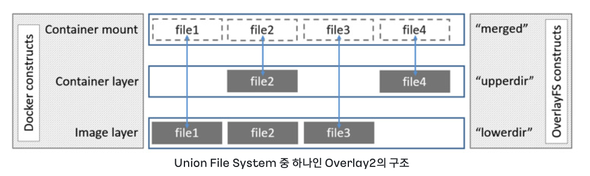

# 컨테이너의 이해
- 컨테이너 기술의 3요소
    - chroot
        - 프로세스에 대하여 새로운 root 디렉토리를 지정
        - 이렇게 새로운 root 디렉토리가 지정된 프로세스는 새롭게 할당된 root 디렉토리 하위로만 접근이 가능
        - `파일 시스템 격리`
    - namespace
        - 프로세스 별 리소스 사용을 분리
        - 서로 다른 namespace에 존재하는 프로세스들은 각각의 namespace에서 리소스 관리를 하여, 서로 영향을 줄 수 없음
        - `리소스 환경 격리`
    - cgroup
        - 프로세스에서 사용하는 시스템의 자원을 관리
        - `시스템 자원 격리 및 제한`

## chroot
- chroot (Change Root Directory)
    - 실제로 chroot를 /home/chroot 에 적용하면 아래와 같은 모습으로 격리가 이뤄진다.
    

    - 사용법
    ```
    chroot [OPTION] NEWROOT [COMMAND [ARG]...]
    ```

- chroot 실습
    ```
    # pwd
    /home
    # mkdir covy
    # chroot covy /bin/bash
    chroot: failed to run command ‘/bin/bash’: No such file or directory
    ```
    - 새로 생성하려고 하는 root를 기준으로 bash 명령어를 찾을 수 없어 에러가 발생
    ```
    # which bash
    /usr/bin/bash
    # mkdir -p ./covy/bin
    # cp /usr/bin/bash ./covy/bin/bash
    # chroot covy /bin/bash
    chroot: failed to run command ‘/bin/bash’: No such file or directory
    ```
    - bash 명령어가 참조하는 라이브러리가 존재하지 않아 에러 발생
    ```
    # ldd /usr/bin/bash
        linux-vdso.so.1 (0x00007fff757cd000)
        libtinfo.so.6 => /lib/x86_64-linux-gnu/libtinfo.so.6 (0x0000767660457000)
        libc.so.6 => /lib/x86_64-linux-gnu/libc.so.6 (0x0000767660200000)
        /lib64/ld-linux-x86-64.so.2 (0x00007676605ff000)
    # mkdir -p ./covy/lib
    # mkdir -p ./covy/lib64
    # cp /lib/x86_64-linux-gnu/libtinfo.so.6 ./covy/lib/
    # cp /lib/x86_64-linux-gnu/libc.so.6 ./covy/lib/
    # cp /lib64/ld-linux-x86-64.so.2 ./covy/lib64/
    # chroot covy /bin/bash
    bash-5.2# pwd
    /
    ```
    - `ldd` 명령어는 '/usr/bin/bash' 실행파일이 의존하는 라이브러리를 출력하는 명령어다.
    - 의존하는 라이브러리들을 복사해주고 실행하면 성공
    ```
    bash-5.2# pwd
    /
    bash-5.2# echo "A" > a.txt
    bash-5.2# ls
    bash: ls: command not found
    bash-5.2# exit
    exit
    root@ip-192-168-1-183:/home# cd /home/covy/
    root@ip-192-168-1-183:/home/covy# ls
    a.txt  bin  lib  lib64
    root@ip-192-168-1-183:/home/covy# cat a.txt
    A
    ```
    - /home/covy 를 기준으로 root 디렉토리가 고정된 것을 알 수 있다.

- chroot 탈옥하기
    - 탈옥 코드 작성 (/home/covy/escape.c)
        ```
        #include <sys/stat.h>
        #include <unistd.h>

        int main(void)
        {
            mkdir(".out",0755);
            chroot(".out");
            chdir("../../../../../");
            chroot(".");

            return execl("/bin/sh","-i",NULL);
        }
        ```
    - 실행파일 만들기
        ```
        sudo apt update
        sudo apt install build-essentia
        gcc escape.c -o escape
        ```
    - chroot로 실행하기
        ```
        root@ip-192-168-1-183:/home/covy# chroot ./ /bin/bash
        bash-5.2# ls
        bash: ls: command not found
        bash-5.2# ./escape
        # ls
        bin		   boot  etc   lib		  lib64       media  opt   root  sbin		     snap  sys	usr
        bin.usr-is-merged  dev	 home  lib.usr-is-merged  lost+found  mnt    proc  run	 sbin.usr-is-merged  srv   tmp	var
        ```

- 탈옥 방지하기 - pivot_root 사용
    ```
    root@ip-192-168-1-183:/home/covy# unshare --mount /bin/bash
    root@ip-192-168-1-183:/home/covy# cd ..
    root@ip-192-168-1-183:/home# mkdir pivot_covy
    root@ip-192-168-1-183:/home# mount -t tmpfs -o size=100M none pivot_covy
    root@ip-192-168-1-183:/home# cp -r /home/covy/* /home/pivot_covy/
    root@ip-192-168-1-183:/home# mkdir -p /home/pivot_covy/old_fs
    root@ip-192-168-1-183:/home# cd /home/pivot_covy/
    root@ip-192-168-1-183:/home/pivot_covy# pivot_root . old_fs
    root@ip-192-168-1-183:/home/pivot_covy# ./escape
    ```


## Namespace

- Namespace의 종류
    - MNT : 마운트 시, 파일 시스템을 격리
    - PID : Process ID를 격리한다. Namespace가 서로 다른 프로세스끼리는 접근할 수 없게 된다.
    - NET : 네트워크 리소스를 격리한다. 가상의 네트워크 장치를 할당한다.
    - IPC : IPC(Inter-Process Communication)를 격리하여, 다른 프로세스의 접근을 방지한다.
    - UTS : 호스트 이름과 도메인 이름을 격리한다. (UNIX Timesharing System)
    - USER : UID, GID 정보를 격리한다.

- Namespace의 분리
    ```
    unshare [options] [<program>[<argument>...]]
    ```

- 실제 분리된 Namespace 확인해보기
    - 1번 프로세스를 기준으로 Namespace 정보를 확인
        ```
        # /proc/[PID]/ns에서 해당 프로세스의 Namespace 정보를 확인할 수 있다.
        root@ip-192-168-1-183:/home/covy# ls -al /proc/1/ns
        total 0
        dr-x--x--x 2 root root 0 Aug  1 00:33 .
        dr-xr-xr-x 9 root root 0 Aug  1 00:32 ..
        lrwxrwxrwx 1 root root 0 Aug  1 06:24 cgroup -> 'cgroup:[4026531835]'
        lrwxrwxrwx 1 root root 0 Aug  1 07:45 ipc -> 'ipc:[4026531839]'
        lrwxrwxrwx 1 root root 0 Aug  1 07:45 mnt -> 'mnt:[4026531841]'
        lrwxrwxrwx 1 root root 0 Aug  1 07:45 net -> 'net:[4026531840]'
        lrwxrwxrwx 1 root root 0 Aug  1 00:33 pid -> 'pid:[4026531836]'
        lrwxrwxrwx 1 root root 0 Aug  1 07:45 pid_for_children -> 'pid:[4026531836]'
        lrwxrwxrwx 1 root root 0 Aug  1 07:45 time -> 'time:[4026531834]'
        lrwxrwxrwx 1 root root 0 Aug  1 07:45 time_for_children -> 'time:[4026531834]'
        lrwxrwxrwx 1 root root 0 Aug  1 07:45 user -> 'user:[4026531837]'
        lrwxrwxrwx 1 root root 0 Aug  1 07:45 uts -> 'uts:[4026531838]'
        ```
    - 다른 Namespace를 사용하는 환경을 구성하기 위해 Docker Container 실행
        ```
        root@ip-192-168-1-183:/home/covy# docker pull nginx
        root@ip-192-168-1-183:/home/covy# docker run -itd --name test nginx

        root@ip-192-168-1-183:/home/covy# ps -ef | grep nginx
        root       10053   10025  0 07:47 pts/0    00:00:00 nginx: master process nginx -g daemon off;
        message+   10101   10053  0 07:47 pts/0    00:00:00 nginx: worker process
        message+   10102   10053  0 07:47 pts/0    00:00:00 nginx: worker process
        root       10109    1201  0 07:47 pts/1    00:00:00 grep --color=auto nginx
        ```
    - 실제 분리된 Namespace 확인해보기 -> 해당 컨테이너에서 실행되고 있는 nginx process(PID: 10053)기준으로 확인
        ```
        root@ip-192-168-1-183:/home/covy# ls -al /proc/10053/ns
        total 0
        dr-x--x--x 2 root root 0 Aug  1 07:47 .
        dr-xr-xr-x 9 root root 0 Aug  1 07:47 ..
        lrwxrwxrwx 1 root root 0 Aug  1 07:48 cgroup -> 'cgroup:[4026532290]'
        lrwxrwxrwx 1 root root 0 Aug  1 07:48 ipc -> 'ipc:[4026532225]'
        lrwxrwxrwx 1 root root 0 Aug  1 07:48 mnt -> 'mnt:[4026532223]'
        lrwxrwxrwx 1 root root 0 Aug  1 07:47 net -> 'net:[4026532227]'
        lrwxrwxrwx 1 root root 0 Aug  1 07:48 pid -> 'pid:[4026532226]'
        lrwxrwxrwx 1 root root 0 Aug  1 07:48 pid_for_children -> 'pid:[4026532226]'
        lrwxrwxrwx 1 root root 0 Aug  1 07:48 time -> 'time:[4026531834]'
        lrwxrwxrwx 1 root root 0 Aug  1 07:48 time_for_children -> 'time:[4026531834]'
        lrwxrwxrwx 1 root root 0 Aug  1 07:48 user -> 'user:[4026531837]'
        lrwxrwxrwx 1 root root 0 Aug  1 07:48 uts -> 'uts:[4026532224]'
        ```
        > Namespace 정보가 다른 것을 확인할 수 있다.


## CGroup
- CGroup (Control Group)을 활용해 제한 가능한 자원의 종류
    - CPU: 스케쥴러를 사용하여 해당 CGroup에 속한 프로세스의 CPU 사용시간을 제어
    - memory: 프로세스의 메모리 사용량을 제어
    - blkio: Block I/O에 대한 제한 설정
    - cpuset: 개별 CPU 및 메모리 노드를 CGroup에 바인딩하기 위한 서브 시스템
    - devices: 장치에 대한 액세스를 허용하거나 거부
    - etc.

- Docker Inspect 확인해보기
    ```
    root@ip-192-168-1-183:/home/covy# docker inspect test | grep Cpu
                "CpuShares": 0,
                "NanoCpus": 0,
                "CpuPeriod": 0,
                "CpuQuota": 0,
                "CpuRealtimePeriod": 0,
                "CpuRealtimeRuntime": 0,
                "CpusetCpus": "",
                "CpusetMems": "",
                "CpuCount": 0,
                "CpuPercent": 0,
    ```

- CGroup을 활용하여 리소스 제한하기 (Docker 이용)
```
docker run -itd --name [name] \
--memory (컨테이너에서 사용 가능한 메모리 제한)
--cpu-shares (기본 값 1024를 기준으로하는 가중치)
--cpuset-cpus (특정 CPU만 사용하도록 설정)
--cpu-period, --cpu-quota (컨테이너가 할당받는 CPU 주기를 결정)
--cpus (보다 직관적으로 사용하는 CPU 개수 지정)
--device-write-bps, --device-read-bps (Bloci I/O 지정)
```

## Union File System
- 여러 개의 파일 시스템(Layer)를 하나의 파일 시스템(Union)으로 취급하는 파일 시스템
- 이미지 영역과 사용자 영역이 분리되어 있으며 Copy on Write(COW) 전략을 사용하여 상위 레이어(사용자 영역)에서 하위 레이어(이미지 영역)에 영향을 주지 않는다.

    


